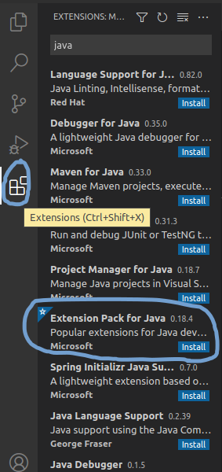
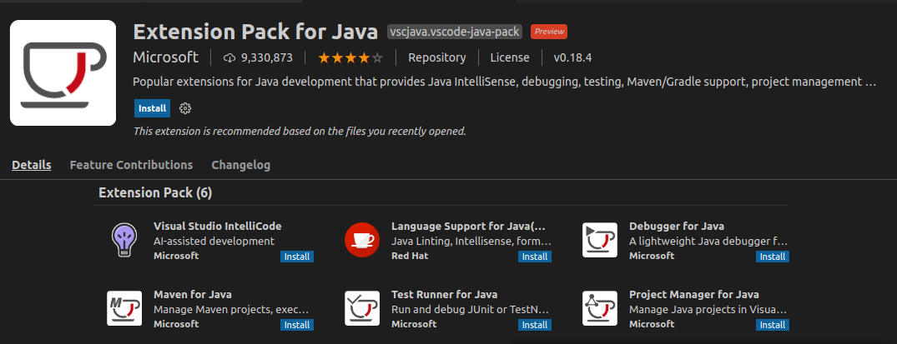
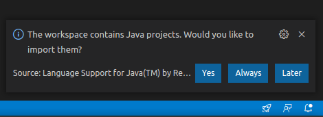
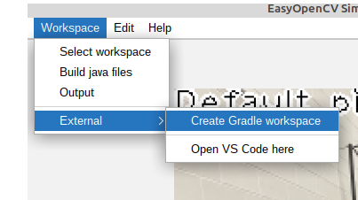
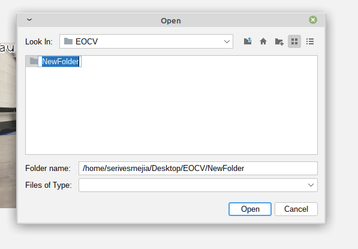

# VS Code and IntelliJ IDEA

Both IntelliJ IDEA and VS Code are the IDE and Text Editor recommended to use for EOCV-Sim. While IntelliJ is a fully featured IDE specifically designed for Java, with consistent and great autocompletion, refactoring features, etc, VS Code is more lightweight and faster in computers with limited resources.

This guide will explain how to use any of these two, you can choose whichever suits you the best.

## VS Code

**Make sure you installed a JDK as explained in the** [**Dowloading EOCV-Sim**](../downloading-eocv-sim.md) **section.**

1. Download VS Code in [here](https://code.visualstudio.com) if you haven't already.
2. Open VS Code and install the [Extension Pack for Java](https://marketplace.visualstudio.com/items?itemName=vscjava.vscode-java-pack), going to the extensions section, search for "java" in the search box at the top and find the extension that looks like the following screenshot.





1. Click on the blue "Install" button and restart VS Code.
2. Do the steps specified in the [**Creating a Gradle workspace**](vscode-and-intellij.md#creating-a-gradle-workspace) section
3. Once you have done the steps in that section, go back to VS Code. If it wasn't opened automatically by EOCV-Sim, open it manually and select the folder you created in EOCV-Sim.
4. If the language support plugin asks to import the project on the bottom right, click on yes.



1. Wait for the import process to finish; see the tiny loading icon in the bottom right.
2. Pop up the `src/main/java` folder. This is where you will put your pipelines.
3. To create a new pipeline, right-click on the `java` folder and then choose "New File". Give the file a name and a `.java` extension (append it at the end of the name, for example `GrayscalePipeline.java`)
4. Copy and paste this template to have a base to create your pipeline. Replace the name of the class with the name you gave the file where it's indicated

```java
import org.opencv.core.Mat;
import org.opencv.imgproc.Imgproc;
import org.openftc.easyopencv.OpenCvPipeline;

public class <Name Here> extends OpenCvPipeline {

    @Override
    public Mat processFrame(Mat inputMat) {
        // Your code here
        return inputMat;
    }

}
```

If you have EOCV-Sim opened, every time you save the file in the editor (you can use Ctrl + S) a new build will be executed. If your pipeline was compiled successfully, it will be added to the list with a "gears" icon in the list to differentiate it.

However, if the build failed, you will be presented with an output error message saying where the errors are located exactly. VS Code IntelliSense should help you with finding these issues.

Refer to the [pipelines section](../introduction/pipelines/) if you want to learn more about pipelines.

## IntelliJ IDEA

1. Do the steps specified in the[ Creating a Gradle workspace](vscode-and-intellij.md#creating-a-gradle-workspace) section
2. Open IntelliJ IDEA and import the Gradle workspace you just created:

.png>)

Alternatively, if you're not at the starter screen of IntelliJ IDEA, you can also do the following:

.png>)

3. Navigate through the src/main/java folders, you'll then find the packages in which you'll be able to start adding your own pipelines

.png>)

4. Create a new Java class anywhere within the src/main/java folder. To create a pipeline, you can start with this template

```java
import org.opencv.core.Mat;
import org.opencv.imgproc.Imgproc;
import org.openftc.easyopencv.OpenCvPipeline;

public class <Name Here> extends OpenCvPipeline {

    @Override
    public Mat processFrame(Mat inputMat) {
        // Your code here
        return inputMat;
    }

}
```

If you have EOCV-Sim opened, every time you make a change in IntellIj a new build will be executed. If your pipeline was compiled successfully, it will be added to the list with a "gears" icon in the list to differentiate it.

## Creating a Gradle workspace

1. Open EOCV-Sim (follow [this page](../downloading-eocv-sim.md#running-eocv-sim) if needed)
2. In the top bar menu, go to **Workspace -> External -> Create Gradle Workspace**



1. In the file explorer, create a new empty folder or select one that already exists but has no files. You can't use a folder that already has files in it. Click on the folder icon with a "+" in the top, and give the new folder a name.



1. Select the newly created folder and click on "open".&#x20;

It will pop up a dialog asking if you want to open VS Code.

* If you were following the VS Code guide, click on "Yes" once it asks if you want to open it, and go back to [step #5](vscode-and-intellij.md#vs-code).
* If you were following the IntelliJ IDEA guide, click on "No" and go back to step #2.

