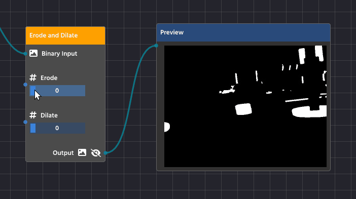
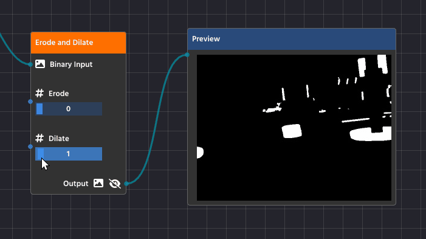

# Additional Tips

## Erode and Dilate

**Erosion and Dilation** are basic morphological operations performed on a binary image (the black and white image created by thresholding). They help refine the shape of the white objects by either shrinking or expanding their boundaries, which is crucial for cleaning up your final contours. You'll find these functions combined in the **Erode Dilate Node** (in the Image Processing category).

### Erosion (Shrinking)

Erosion is the process of making the white shapes shrink or _wither away_.

#### Detailed Purpose:

* **Noise Removal:** Erosion acts as a final filter against tiny, isolated white specks (noise) that survived the earlier blurring process. Since these specks are very small, the shrinking process completely eliminates them, cleaning up your mask.
* **Separating Touching Objects:** If two objects are so close they're touching, the erosion process can carve out the small connection between them, successfully turning them into two separate shapes that your contour detector can analyze individually.

### Dilation (Expanding)

Dilation is the opposite process—it makes the white shapes expand or _grow_.

#### Detailed Purpose:

* **Filling Gaps and Holes:** Dilation is essential for closing up small, black "holes" inside a white shape or connecting broken sections of what should be a single object. If a contour is broken due to poor lighting, dilation helps fuse those parts back together.
* **Strengthening Faint Shapes:** It can make thin or faint shapes more substantial, ensuring they are thick enough to be reliably detected as a solid contour.

## Blurring

Blurring, while seemingly counter-intuitive for detection, is a vital step used to increase the reliability and robustness of your computer vision pipeline. It is almost always applied before your Color Threshold node.

### Why Blur?

The primary purpose of blurring is noise reduction and smoothing edges.

* **Reduce Noise**: A real-world camera feed often contains high-frequency noise, which shows up as tiny, single-pixel errors or speckles in your image. To the computer, these speckles can look exactly like small objects, leading to hundreds of false Contours after thresholding. Blurring averages out the color of these tiny noisy pixels with their neighbors, effectively making them disappear.
* **Smooth Edges**: Blurring helps to smooth out harsh, jagged edges caused by camera limitations or compression artifacts. This makes the boundaries of your actual target objects cleaner and more continuous, resulting in better, more accurate Contours when you run the detection phase.

### Using the Blur Node

You will use the Blur Node (found in the Image Processing category) to apply this filter.

1. Placement: Connect the output of your Pipeline Input node directly to the Blur node's Input.
2. Algorithm: The most common and effective algorithm is Gaussian Blur, which uses a weighted average that prioritizes pixels closer to the center, creating a very natural blur effect.
3. Value: This integer controls the strength of the blur.
   * Start with a low value, typically 1 or 3.
   * Increase the value slowly. A value that is too high will begin to merge your target object's color with the background, making detection impossible.

A small amount of blur is usually enough to significantly clean up the image without destroying the features you want to detect.

.png>)

