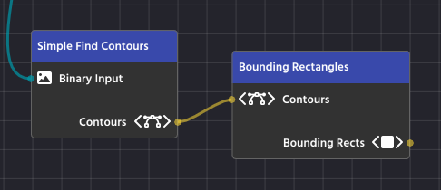

# Bounding Rectangles

After your computer vision pipeline has found and filtered the Contours (the precise outlines) of your target objects, the final goal is to turn those complex outlines into simple, actionable data. Bounding Rectangles are the standardized boxes used to achieve this, making the object's location, size, and orientation easy to read and use in your robot's code.

Essentially, a bounding rectangle is the smallest, simplest box you can draw around a shape that still completely contains the original object. There are two main types you'll use:

### 1. The Simple Box: Axis-Aligned Bounding Rectangles

This is the fastest and easiest type of bounding box to use, often simply called a Bounding Rect.

* **What It Is**: This is the smallest rectangle that surrounds your object, but its sides _must_ always stay straight up and down—parallel to the edges of your image (the X and Y axes). It never rotates.
* **The Data You Get**: You get four simple numbers: the X and Y coordinates of the top-left corner of the rectangle, and the width and height of the box. This is enough to know exactly where the object is and how big it is.
* **When to Use It**: Use this type when your object is mostly straight or when you only need a quick box to define its general location.

In PaperVision, the "Bounding Rectangles" Node handles this task, taking a complex contour and outputting a simple, upright box.

***

### 2. The Snug-Fit Box: Bounding Rotated Rectangles

For objects that are tilted or rotated in the image, the simple Axis-Aligned box is often too big and inaccurate.

* **What It Is**: This is the smallest rectangle that surrounds your object, and it is allowed to rotate to fit the object perfectly. It provides the tightest possible fit around the target.
* **The Data You Get**: This box provides more detailed information: the center point of the object (xc, yc), the precise width and height of the rotated box, and, most importantly, the angle of rotation.
* **When to Use It**: Use this when the orientation (the angle) of the object is critical to your task (like aligning your robot to a specific side of a target) or when you need a highly precise measurement of the object's true size.

In PaperVision, you'll use the "Bounding Rotated Rectangles" node to generate this more detailed and precise data from a list of contours

.png>)

### 3. Visual Examples

.png>) .png>)

These visual examples clearly demonstrate the difference between the two methods of bounding. The image on the left shows Axis-Aligned Bounding Rectangles, where the boxes are perfectly upright but don't perfectly hug the rotated yellow blocks. Notice how much extra space is contained within the boxes!

The image on the right shows Bounding Rotated Rectangles, where the boxes fit snugly around each yellow block. This snug fit is superior when you need to accurately determine an object's precise size and its exact angle of rotation for robotic alignment or navigation.

> [!NOTE]
> We will learn how to draw shape outlines, such as this example, in the "[Overlaying](overlaying.md)" chapter.
